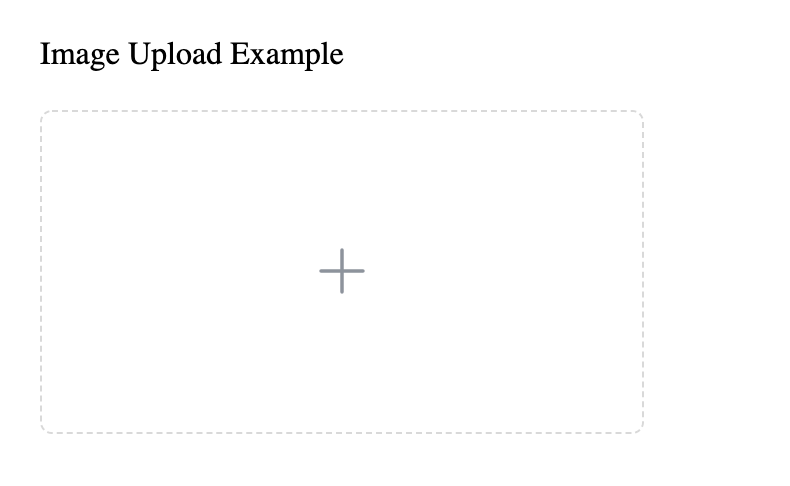
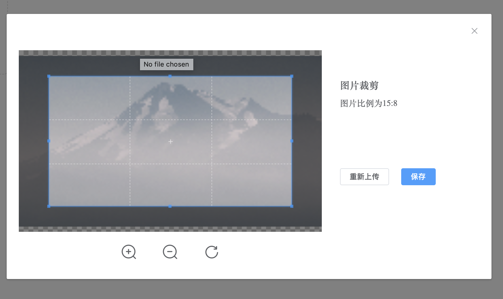

# 图片上传剪切组件

vue-cropper-image 是基于 [Cropper.js](https://github.com/fengyuanchen/cropperjs) 实现的图片上传剪切组件。




## Usage

``` html
<template>
  <vue-cropper-image v-model="imgKey" :width="750" :height="400"></vue-cropper-image>
</template>
```

## Properties

| 参数 | 说明 | 类型 | 可选值 | 默认值 |
|-----------|-----------|-----------|-----------|-------------|
| value / v-model | 绑定值 | `String` | - | - |
| domain | 文件保存域名，必填 | `String` | - | - |
| accept | 图片上传类型限制 | `String` | - | `image/*` |
| outputType | 图片剪切后导出类型 | `String` | - | `png` |
| width | 图片宽度 | `Number` | - | `200` |
| height | 图片高度 | `Number` | - | `200` |
| viewWidth | 图片上传组件宽度，大于0时有效，为0时取`width`的值 | `Number` | - | `0` |
| viewHeight | 图片上传组件高度，大于0时有效，为0时取`height`的值 | `Number` | - | `0` |
| rate | 图片剪切比率，剪切出的图片宽度`width * rate`和高度`height * rate` | `Number` | - | `1` |
| disabled | 是否禁用 | `Boolean` | - | `false` |
| defaultUrl | 默认图片 | `String` | - | - |
